

 

# CODEXA

### Your Ultimate Coding Analytics Companion

*Track · Visualize · Dominate*

 

&nbsp;

&nbsp;

 

> 📌 **Note:** Enable **Unknown Sources** in your Android settings before installing.

 

---

## 📚 Table of Contents

- [Overview](#-overview)
- [Features](#-features)
- [Screenshots](#-screenshots)
- [Tech Stack](#-tech-stack)
- [Contact](#-contact--feedback)

---

## 📝 Overview

**Codexa** is a modern, beautifully crafted coding analytics app built for developers and competitive programmers.

> Monitor your coding journey — solved problems, contest growth, submissions, streaks, and profile insights — all from a single polished dashboard.

Whether you're a beginner tracking your first 100 problems or a seasoned coder optimizing for contest ratings, Codexa gives you the clarity and motivation to level up.

---

## ✨ Features

| Feature | Description |
|---|---|
| 📊 **Unified Coding Stats** | Track performance across LeetCode, CodeChef, Codeforces, GitHub & HackerRank |
| 📈 **Interactive Dashboard** | View trends for solved problems, contest ratings & activity heatmaps |
| 🔄 **Smart Syncing** | Fast refresh with cached data for smooth, up-to-date analytics |
| 🎯 **Platform Insights** | Rankings, streaks, badges, submissions & repos — per platform |
| 🧩 **Projects Showcase** | Highlight GitHub repos with stars, forks, issues, topics & activity |
| 👤 **Developer Portfolio** | Skills, experience, education & social links — all in one place |
| 🎨 **Beautiful UI/UX** | Glassmorphism design, responsive layouts & smooth animations |
| 🔔 **In-App Notifications** | Reminders, update alerts & smart nudges to keep you on track |

---

## 📸 Screenshots

<table>
  <tr>
    <td width="33%" align="center">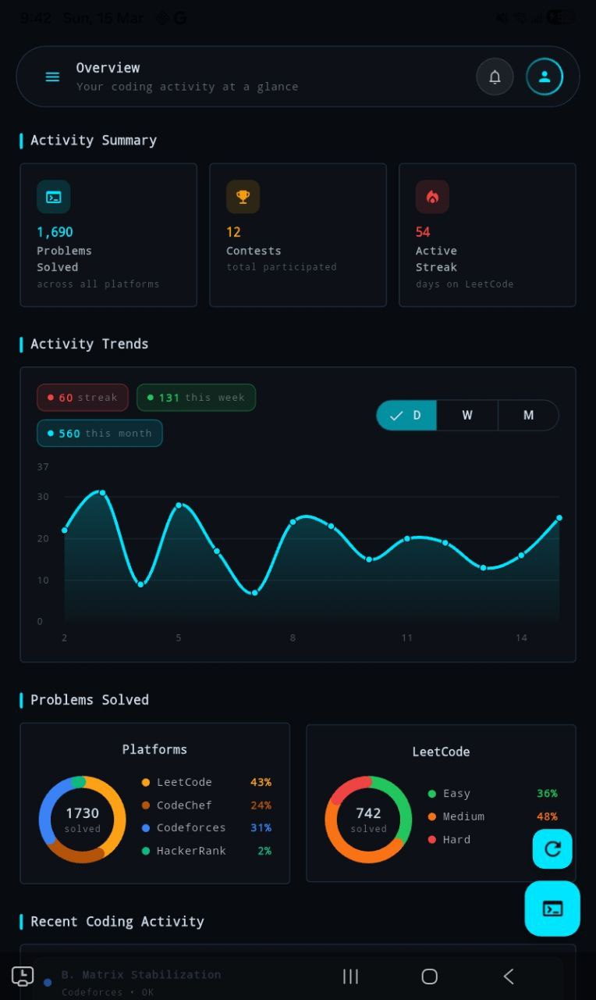</td>
    <td width="33%" align="center">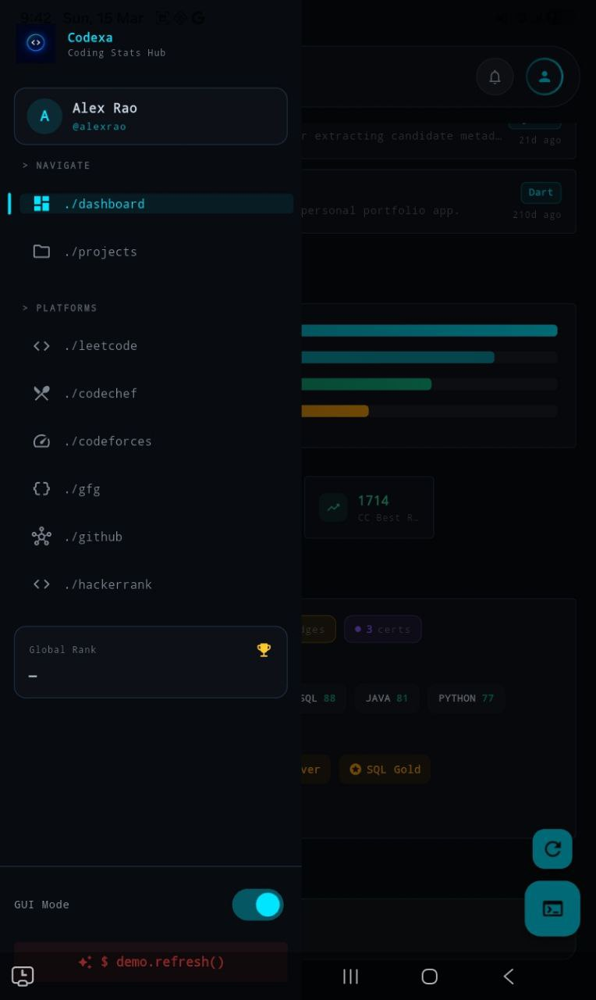</td>
    <td width="33%" align="center">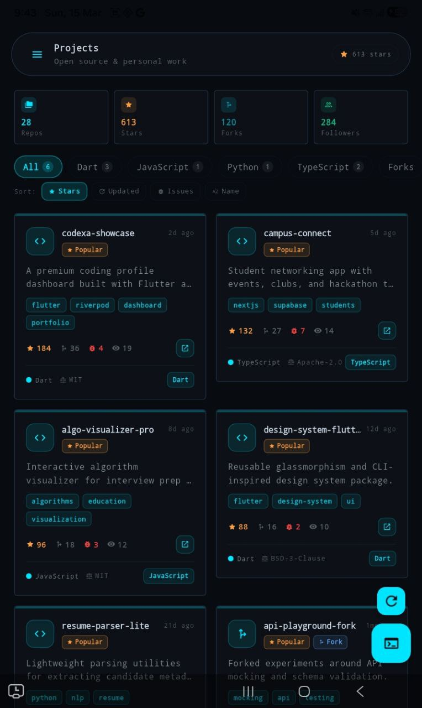</td>
  </tr>
  <tr><td colspan="3"> </td></tr>
  <tr>
    <td width="33%" align="center">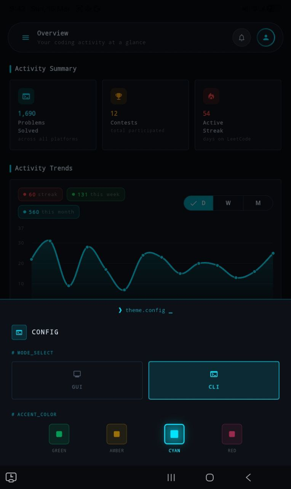</td>
    <td width="33%" align="center">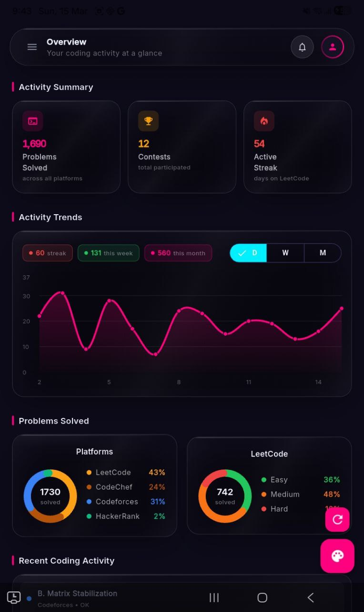</td>
    <td width="33%" align="center">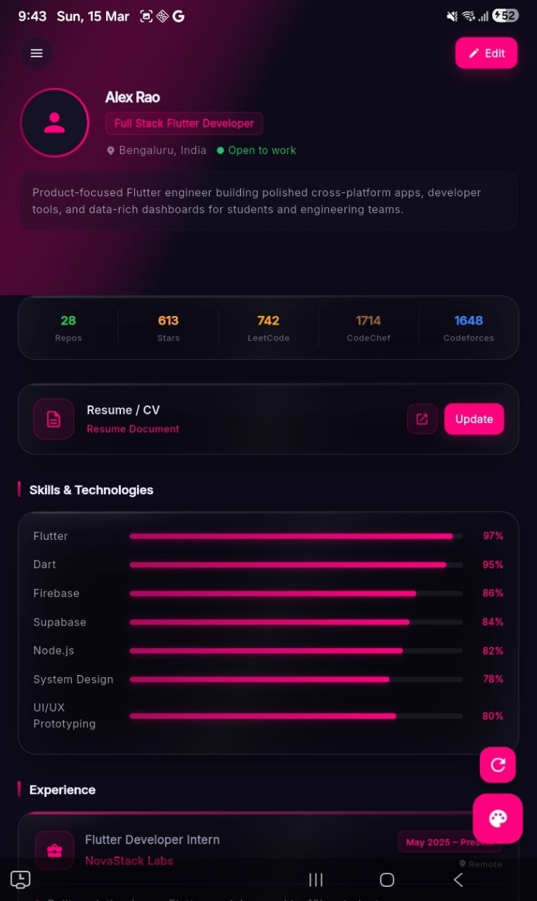</td>
  </tr>
  <tr><td colspan="3"> </td></tr>
  <tr>
    <td width="33%" align="center">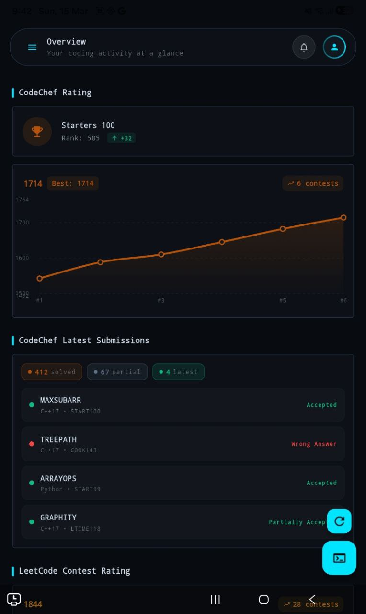</td>
    <td width="33%" align="center"></td>
    <td width="33%" align="center">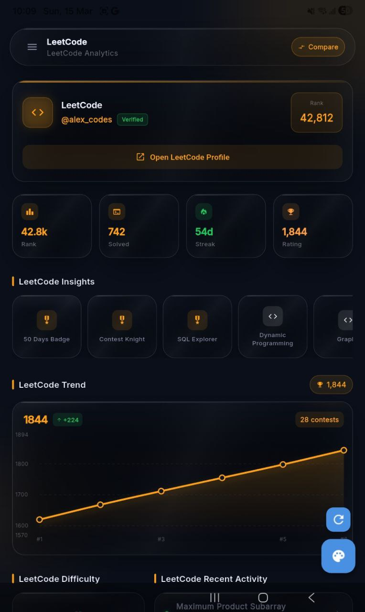</td>
  </tr>
  <tr><td colspan="3"> </td></tr>
  <tr>
    <td width="33%" align="center">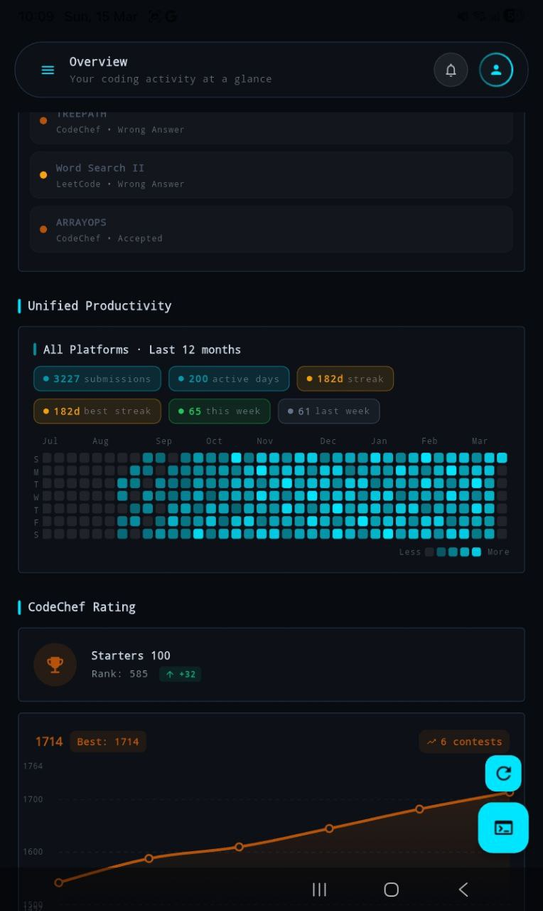</td>
    <td width="33%" align="center">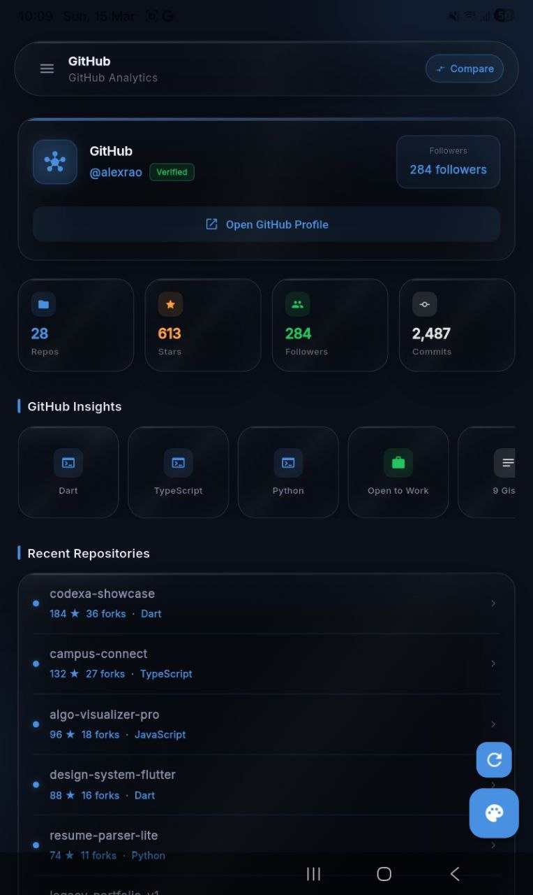</td>
    <td width="33%" align="center">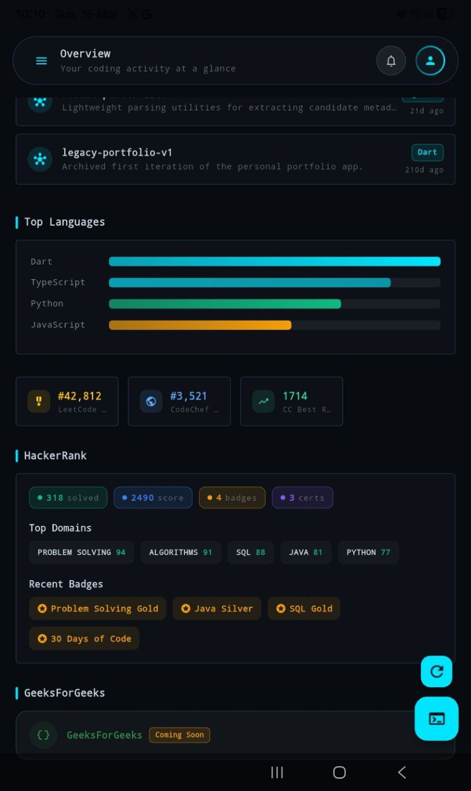</td>
  </tr>
</table>

---

## 💻 Tech Stack

### 🧱 Core Framework

### 🔀 State Management & Routing

### 🗄️ Backend & Data

### 🎨 UI & Design

### 🛠️ Utilities

---

## 📬 Contact & Feedback

Have suggestions, bug reports, or collaboration ideas? I'd love to hear from you!

| | |
|---|---|
| 👤 **Developer** | Deepanshu Kaushik |
| 📧 **Email** | [imdeepanshu4work@gmail.com](mailto:imdeepanshu4work@gmail.com) |

 

---

### ⭐ If you find Codexa useful, consider starring the repo!

*It motivates continued development and helps others discover the project.*

 

**Developed with ❤️ by [Deepanshu Kaushik](mailto:imdeepanshu4work@gmail.com)**

 

